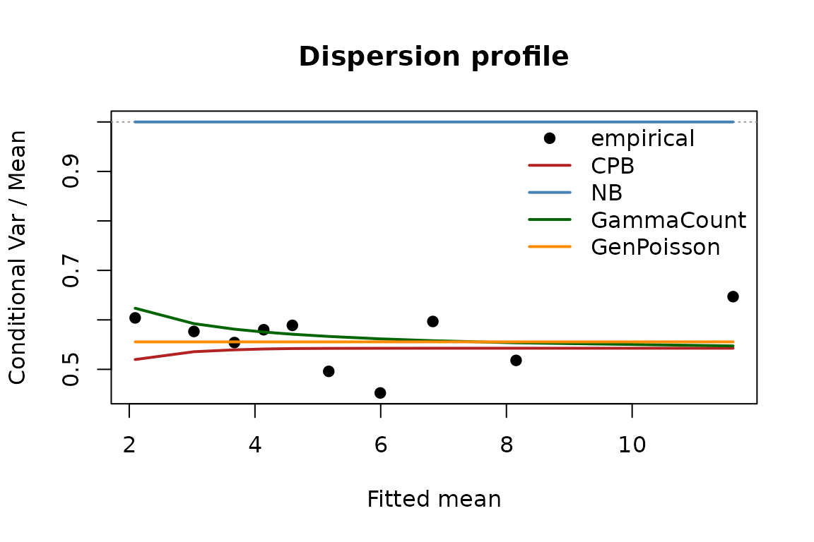
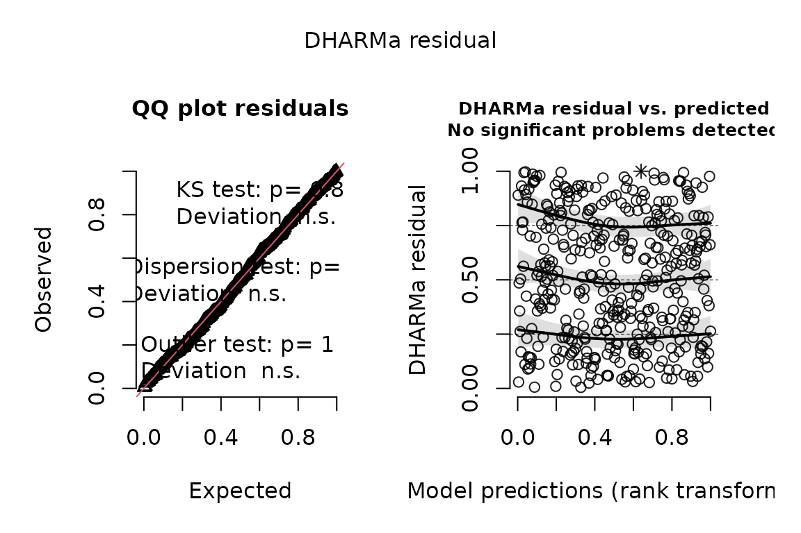

# Detecting and Modeling Underdispersed Counts

`underdisp` provides tools for detecting and modeling *underdispersion*
in count data: the case where the conditional variance is below the
conditional mean, so counts cluster more tightly around their
expectation than a Poisson allows. The Poisson and negative binomial
defaults cannot represent it; the negative binomial in particular
collapses onto the Poisson when the data are underdispersed.

``` r

library(underdisp)
```

## Simulating an underdispersed count

We generate a count with a conditional variance-to-mean ratio of about
one half.

``` r

n <- 400
x <- rnorm(n)
N <- pmax(round(exp(1.6 + 0.5 * x) / 0.5), 1)
y <- rbinom(n, N, 0.5)
d <- data.frame(y = y, x = x)
c(mean = mean(y), var = var(y), ratio = var(y) / mean(y))
#>      mean       var     ratio 
#>  5.527500 10.435332  1.887894
```

## Screening

[`ud_screen()`](https://bagozzib.github.io/underdisp/reference/ud_screen.md)
returns a marginal verdict, and, for zero-inflated outcomes, an at-risk
verdict benchmarked against a *zero-truncated* Poisson (which is what
separates genuine underdispersion from the artifact of conditioning on
positive counts).

``` r

ud_screen(y ~ x, data = d, run_cpb = FALSE)
#> 
#> === Underdispersion screen ===
#> Formula: y ~ x 
#> N=400  mean=5.527  max=22  %zero=1.8  (unconditional var/mean=1.89)
#> 
#> MARGINAL verdict: UNDERDISPERSED 
#>    Pearson=0.564  prop.slope=-0.391 (p=<2e-16)
#>    NB vs Poisson LR = -0.01 (p= 0.5 ; sig => overdispersion)
#> 
#> AT-RISK (y>0) verdict:UNDERDISPERSED  [n_pos=393]
#>    ZTP-Pearson = 0.569  (underdispersed if < 0.885, the calibrated 5% threshold)
#> 
#> Model comparison (log-lik):
#>  Poisson       NB       GP     COMP      CPB 
#> -798.901 -798.904 -798.901 -772.010       NA 
#> 
#> COM-Poisson (full data): nu = 1.84  (> 1 = underdispersed, soft tail)
```

## Fitting the continuous parameter binomial

[`cpb()`](https://bagozzib.github.io/underdisp/reference/cpb.md) fits
the CPB, with `truncated = TRUE` for the common case in which
underdispersion lives among the positive counts of a zero-inflated
outcome.

``` r

fit <- cpb(y ~ x, data = d[d$y > 0, ], se = "none")
summary(fit)
#> 
#> Continuous Parameter Binomial regression (zero-truncated)
#> N = 393    inference: none 
#> 
#>             Estimate Std. Error z value Pr(>|z|)
#> (Intercept)  1.58388         NA      NA       NA
#> x            0.48948         NA      NA       NA
#> 
#> alpha = 0.5364   (profile 95% CI: 0.493 to 0.614)
#> Implied ceiling lambda/(1-alpha): median 10.47   range 2.56 to 38.45 
#> logLik = -745.08    AIC = 1496.16 
#> LR vs ZT-Poisson (H0: alpha = 1): 58.60, p 9.6764e-15
```

The dispersion parameter `alpha` summarizes the compression, and each
observation carries an implied ceiling `lambda / (1 - alpha)`. The CPB
is a binomial with a non-integer number of trials, renormalized over its
finite support, so its mean is not exactly the rate `exp(x'b)`:
[`fitted()`](https://rdrr.io/r/stats/fitted.values.html) and
`predict(type = "response")` report the exact mean of the fitted
distribution (the conditional mean given `Y >= 1` for a zero-truncated
fit), and `predict(type = "rate")` the rate.

## Quantities of interest

Predicted means, the implied ceiling, and first differences are
available for user-specified covariate profiles.

``` r

predict(fit, newdata = data.frame(x = c(-1, 0, 1)), type = "response")
#> [1] 3.038253 4.880511 7.951650
implied_ceiling(fit, newdata = data.frame(x = 0))
#>     lambda  ceiling    lower    upper
#> 1 4.873821 10.51349 9.619503 12.61268
first_difference(fit, "x", from = -1, to = 1)
#>  component  from    to  diff
#>       mean 3.038 7.952 4.913
```

## Testing equidispersion

The Poisson is the equidispersed member of every family in the package
(`alpha = 1` for the CPB, `delta = 1` for the GEC, `nu = 1` for the
COM-Poisson, and so on), so
[`dispersion_test()`](https://bagozzib.github.io/underdisp/reference/dispersion_test.md)
tests a fitted model’s dispersion parameter against its Poisson value by
a likelihood-ratio test on the fitted design, with fixed effects carried
into the null. Where the Poisson value sits on the boundary of the
parameter space (the CPB, the negative binomial) the test uses the
Self–Liang mixture and is one-sided; elsewhere the alternative can be
two-sided or directional. For a plain Poisson fit the Cameron–Trivedi
auxiliary regression is available as `method = "auxiliary"`.

``` r

dispersion_test(fit)
#> 
#> Likelihood-ratio test of equidispersion (CPB vs Poisson; boundary null, Self-Liang mixture)
#> 
#> data: y ~ x
#> LR = 58.5968  (logLik: fitted family = -745.08, Poisson = -774.38),  p-value = 9.676e-15
#> alternative hypothesis: underdispersion
#> estimate: alpha = 0.5364  (Poisson value 1)
dispersion_test(count_reg(y ~ x, data = d, family = "poisson"),
                method = "auxiliary", alternative = "under")
#> 
#> Cameron-Trivedi auxiliary regression test of equidispersion (Var = mu + a mu^2)
#> 
#> data: y ~ x
#> t = -9.3813,  p-value = < 2.2e-16
#> alternative hypothesis: underdispersion
#> estimate: a = -0.0619  (Poisson value 0)
```

## Bootstrap inference

Because the CPB’s support depends on its parameters, Hessian-based
standard errors are unreliable; coefficient inference uses a
cold-multistart pairs bootstrap (validated to nominal coverage in the
companion paper), and the dispersion parameter carries a
profile-likelihood interval. `cores =` runs the replicates on a socket
cluster seeded from the session.

``` r

fit_b <- cpb(y ~ x, data = d[d$y > 0, ], se = "bootstrap", B = 99)
summary(fit_b)
#> 
#> Continuous Parameter Binomial regression (zero-truncated)
#> N = 393    inference: bootstrap 
#> 
#>             Estimate Std. Error z value  Pr(>|z|)    
#> (Intercept) 1.583878   0.017408  90.983 < 2.2e-16 ***
#> x           0.489478   0.018386  26.622 < 2.2e-16 ***
#> ---
#> Signif. codes:  0 '***' 0.001 '**' 0.01 '*' 0.05 '.' 0.1 ' ' 1
#> 
#> alpha = 0.5364   (profile 95% CI: 0.493 to 0.614)
#> Implied ceiling lambda/(1-alpha): median 10.47   range 2.56 to 38.45 
#> logLik = -745.08    AIC = 1496.16 
#> LR vs ZT-Poisson (H0: alpha = 1): 58.60, p 9.6764e-15
#> (99 bootstrap resamples converged)
irr(fit_b)             # rate ratios with percentile intervals
#>         term equation ratio estimate lower upper             method
#>  (Intercept)    count   IRR    4.874 4.721 5.045 bootstrap (stored)
#>            x    count   IRR    1.631 1.579 1.686 bootstrap (stored)
confint(fit_b)         # coefficients (percentile) and alpha (profile likelihood)
#>                  2.5%     97.5%
#> (Intercept) 1.5519882 1.6183956
#> x           0.4566045 0.5224254
#> alpha       0.4933396 0.6135776
```

## The free-dispersion GEC

[`gec()`](https://bagozzib.github.io/underdisp/reference/gec.md) fits
King’s generalized event count (Katz) model, whose dispersion `delta` is
estimated freely, so the data choose the direction of dispersion rather
than the analyst presuming it. On the underdispersed count above it
recovers `delta` well below one; on a Poisson outcome it sits at one.

``` r

gec(y ~ x, data = d, se = "none")                                  # delta ~ 0.5
#> Generalized event count (Katz family) regression
#> Call:  gec(formula = y ~ x, data = d, se = "none")
#> (Intercept)           x 
#>      1.5768      0.4964 
#> 
#> dispersion delta (Katz; Var/Mean on an unbounded support) = 0.553  [underdispersed]
#> logLik = -769.78,  n = 400
gec(y ~ x, data = data.frame(y = rpois(n, exp(1 + 0.4 * x)), x = x),
    se = "none")                                                   # delta ~ 1
#> Generalized event count (Katz family) regression
#> Call:  gec(formula = y ~ x, data = data.frame(y = rpois(n, exp(1 + 0.4 *     x)), x = x), se = "none")
#> (Intercept)           x 
#>      0.9649      0.3493 
#> 
#> dispersion delta (Katz; Var/Mean on an unbounded support) = 0.954  [underdispersed]
#> logLik = -740.83,  n = 400
```

The GEC carries the same zero-truncated, hurdle
([`hurdle_gec()`](https://bagozzib.github.io/underdisp/reference/hurdle_gec.md)),
zero-inflated
([`zi_gec()`](https://bagozzib.github.io/underdisp/reference/zi_gec.md)),
and fixed-effects
([`gec_fe()`](https://bagozzib.github.io/underdisp/reference/gec_fe.md))
variants as the CPB.

## High-dimensional fixed effects

Underdispersion is typically a *within-unit* phenomenon that pooled
analyses hide.
[`cpb_fe()`](https://bagozzib.github.io/underdisp/reference/cpb_fe.md)
absorbs a full set of unit fixed effects by concentrating them out of
the likelihood, so it scales to thousands of units.

``` r

panel <- do.call(rbind, lapply(1:50, function(i) {
  xx <- rnorm(12); NN <- pmax(round(exp(rnorm(1, 0, 0.4) + 0.4 * xx) / 0.5), 1)
  data.frame(unit = i, x = xx, y = rbinom(12, NN, 0.5))
}))
fe_fit <- cpb_fe(y ~ x, data = panel, fe = "unit")
fe_fit
#> CPB regression with 50 unit fixed effects (concentrated likelihood)
#> Coefficients:
#>      x 
#> 0.2979 
#> 
#> alpha (shape parameter): 0.4735   median implied bound: 2.25 
#> Note: alpha is subject to incidental-parameters bias for short panels; see ?cpb_fe.
dispersion_test(fe_fit)      # against a Poisson with the same unit effects
#> 
#> Likelihood-ratio test of equidispersion (CPB vs Poisson; boundary null, Self-Liang mixture)
#> 
#> data: y ~ x
#> LR = 216.3067  (logLik: fitted family = -599.47, Poisson = -707.63),  p-value = < 2.2e-16
#> alternative hypothesis: underdispersion
#> estimate: alpha = 0.4735  (Poisson value 1)
```

## Comparing the family

[`compare_dispersion()`](https://bagozzib.github.io/underdisp/reference/compare_dispersion.md)
fits the Poisson, negative binomial, the native soft-tail COM-Poisson,
the free-dispersion GEC, and the hard-ceiling CPB, and reports a fit
comparison plus the CPB’s ceiling-exceedance share.

``` r

compare_dispersion(y ~ x, data = d)$table
#>             df    logLik      AIC      BIC logscore       rps    zero_fit
#> Poisson      2 -798.9009 1601.802 1609.785 1.997252 0.9855061 0.024243957
#> NegBinomial  3 -798.9042 1603.808 1615.783 1.997261 0.9855095 0.024244780
#> COM-Poisson  3 -772.0096 1550.019 1561.994 1.930024 0.9631112 0.009312565
#> CPB          3 -769.2023 1544.405 1556.379 1.923006 0.9642762 0.010281054
#> GEC          3 -769.7769 1545.554 1557.528 1.924442 0.9644015 0.010538440
```

## The wider underdispersed family

Underdispersion has more than one mechanism, and
[`count_reg()`](https://bagozzib.github.io/underdisp/reference/count_reg.md)
fits the distributions that express them through one interface: the
classical COM-Poisson (`"compois"`, rate-parameterized) and Huang’s
mean-parameterized COM-Poisson (`"mpcmp"`, a soft tail), the Consul–Jain
generalized Poisson (`"genpois"`, constant variance-to-mean ratio,
finite support when underdispersed), Winkelmann’s gamma-count
(`"gammacount"`, events with more regular timing than a Poisson
process), and Efron’s double Poisson (`"doublepois"`). Each inherits
fixed effects, zero-truncation, hurdle and zero-inflated forms, offsets,
frequency weights, robust and cluster-robust standard errors, and every
method in the package, so
[`compare_models()`](https://bagozzib.github.io/underdisp/reference/compare_models.md)
places them next to the CPB on one footing.

``` r

fits <- list(
  CPB          = cpb(y ~ x, data = d, truncated = FALSE, se = "none"),
  Poisson      = count_reg(y ~ x, data = d, family = "poisson"),
  NB           = count_reg(y ~ x, data = d, family = "negbin"),
  `COM-Poisson`= count_reg(y ~ x, data = d, family = "mpcmp"),
  GenPoisson   = count_reg(y ~ x, data = d, family = "genpois"),
  GammaCount   = count_reg(y ~ x, data = d, family = "gammacount"),
  DoublePois   = count_reg(y ~ x, data = d, family = "doublepois")
)
do.call(compare_models, fits)
#>             df    logLik      AIC      BIC logscore       rps
#> CPB          3 -769.2023 1544.405 1556.379 1.923006 0.9642762
#> GenPoisson   3 -770.1544 1546.309 1558.283 1.925386 0.9643720
#> GammaCount   3 -771.8363 1549.673 1561.647 1.929591 0.9632720
#> COM-Poisson  3 -772.6416 1551.283 1563.258 1.931604 0.9646314
#> DoublePois   3 -774.3085 1554.617 1566.591 1.935771 0.9651785
#> Poisson      2 -798.9009 1601.802 1609.785 1.997252 0.9855061
#> NB           3 -798.9008 1603.802 1615.776 1.997252 0.9855095
```

On underdispersed data the negative binomial collapses onto the Poisson,
while the underdispersed families capture the compression and win on AIC
and the proper scores. The families differ in how their dispersion moves
with the mean, and
[`dispersion_profile()`](https://bagozzib.github.io/underdisp/reference/dispersion_profile.md)
sets the empirical conditional variance-to-mean ratio, by bins of the
fitted mean, against the curve each family implies:

``` r

dispersion_profile(CPB = fits$CPB, NB = fits$NB, GammaCount = fits$GammaCount,
                   GenPoisson = fits$GenPoisson)
```



The correlated-random-effects device
([`mundlak()`](https://bagozzib.github.io/underdisp/reference/mundlak.md))
and matching `d`/`p`/`q`/`r` functions
([`dcpb()`](https://bagozzib.github.io/underdisp/reference/cpb-distribution.md),
[`dgec()`](https://bagozzib.github.io/underdisp/reference/gec-distribution.md),
[`dcompois()`](https://bagozzib.github.io/underdisp/reference/compois-distribution.md),
[`dgammacount()`](https://bagozzib.github.io/underdisp/reference/gammacount-distribution.md),
[`dgenpois()`](https://bagozzib.github.io/underdisp/reference/genpois-distribution.md),
[`ddoublepois()`](https://bagozzib.github.io/underdisp/reference/doublepois-distribution.md))
round out the family.

## Excess zeros: hurdle and zero-inflated models

Many count outcomes mix a participation process (most units at zero)
with a tight positive count. The bundled peacekeeping panel – the number
of UN operations each state contributes troops to per year – shows the
package’s central move: marginally the count looks overdispersed, but
conditioning on country fixed effects and benchmarking the positive
counts against a zero-truncated Poisson, the at-risk process is
underdispersed.

``` r

data(peacekeeping)
ud_screen(contributions ~ democracy + lgdppc + lpop + milper + factor(iso3),
          data = peacekeeping, run_cpb = FALSE, run_gp = FALSE)
#> 
#> === Underdispersion screen ===
#> Formula: contributions ~ democracy + lgdppc + lpop + milper + factor(iso3) 
#> N=4448  mean=3.191  max=18  %zero=41.5  (unconditional var/mean=4.56)
#> 
#> MARGINAL verdict: OVERDISPERSED 
#>    Pearson=1.086  prop.slope=0.191 (p=<2e-16)
#>    NB vs Poisson LR = 18.11 (p= 1e-05 ; sig => overdispersion)
#> 
#> AT-RISK (y>0) verdict:UNDERDISPERSED  [n_pos=2602]
#>    ZTP-Pearson = 0.841  (underdispersed if < 0.955, the calibrated 5% threshold)
#> 
#> Model comparison (log-lik):
#>   Poisson        NB        GP      COMP       CPB 
#> -6645.816 -6636.761        NA        NA        NA
```

That is the case for a two-part model with an underdispersed intensity.
[`hurdle_cpb()`](https://bagozzib.github.io/underdisp/reference/hurdle_cpb.md)
joins a participation logit to a zero-truncated CPB, and
[`zi_cpb()`](https://bagozzib.github.io/underdisp/reference/zi_cpb.md)
fits the structural-zero mixture;
[`zi_test()`](https://bagozzib.github.io/underdisp/reference/zi_test.md)
and
[`compare_models()`](https://bagozzib.github.io/underdisp/reference/compare_models.md)
adjudicate between them.

``` r

z <- rnorm(n)
yh <- rhurdle_cpb(n, lambda = exp(1.2 + 0.3 * x), alpha = 0.5,
                  p = plogis(0.3 + 0.8 * z))
dh <- data.frame(y = yh, x = x, z = z)
h <- hurdle_cpb(y ~ x, data = dh, participation = ~ z)
zi <- zi_cpb(y ~ x, data = dh, zero = ~ z)
compare_models(hurdle = h, mixture = zi)
#>         df    logLik      AIC      BIC logscore      rps
#> hurdle   5 -609.9920 1229.984 1249.941 1.524980 1.039178
#> mixture  5 -610.1171 1230.234 1250.192 1.525293 1.040128
```

The hurdle’s
[`first_difference()`](https://bagozzib.github.io/underdisp/reference/first_difference.md)
separates the extensive and intensive margins exactly – which channel a
covariate moves, not just the blended marginal effect. One practical
note: because the hurdle factorizes, its participation stage is an
ordinary logistic regression; if a dummy-heavy participation equation
separates, fit that stage with a dedicated bias-reduction package
(`logistf`, `brglm2`) alongside this package’s zero-truncated intensity.

## Weights

Every estimator takes frequency `weights` (a weight of `w` is equivalent
to `w` copies of the row, in the likelihood, the information, and the
bootstrap), so tabulated data fit exactly as the expanded data would:

``` r

w <- sample(1:3, n, TRUE)
c(weighted = count_reg(y ~ x, data = d, family = "gammacount", weights = w)$loglik,
  expanded = count_reg(y ~ x, data = d[rep(seq_len(n), w), ], family = "gammacount")$loglik)
#>  weighted  expanded 
#> -1517.227 -1517.227
```

## Short panels: bias-corrected fixed effects

The concentrated fixed-effects dispersion estimate carries the
incidental- parameters bias of order 1/T: with few observations per
unit, `alpha` is biased *downward* (the panel looks more underdispersed
than it is). `bias_correct = "jackknife"` removes the leading bias term
by the split-panel jackknife of Dhaene and Jochmans (2015), refitting on
each unit’s temporal halves.

``` r

short <- do.call(rbind, lapply(1:30, function(i) {
  xx <- rnorm(8); NN <- pmax(round(exp(1.0 + rnorm(1, 0, 0.4) + 0.3 * xx) / 0.5), 1)
  data.frame(unit = i, x = xx, y = rbinom(8, NN, 0.5))
}))
ml <- cpb_fe(y ~ x, data = short, fe = "unit")
jk <- cpb_fe(y ~ x, data = short, fe = "unit", bias_correct = "jackknife")
c(ml = ml$alpha, jackknife = jk$alpha)   # truth is 0.5; ML is biased downward
#>        ml jackknife 
#> 0.3873911 0.4799668
```

The correction is only valid when the two half-panels estimate the same
parameter (the method’s time-homogeneity requirement), so it carries a
validity gate: the panel is also split cross-sectionally by units – a
placebo that is exchangeable under any time pattern – and if the
temporal halves disagree beyond that placebo noise, the correction is
*refused* with a warning naming the failed assumption and the
maximum-likelihood fit is returned. On a trending or regime-changing
panel, the refusal is the correct answer. The gate is deliberately
powered over sized: in calibration it refuses about 9% of genuinely
homogeneous panels (you keep the ordinary ML fit) while catching 98% of
dispersion regime changes and all smooth unmodeled trends.

## Simulated-residual diagnostics with DHARMa

Every fitted model in the package has a
[`simulate()`](https://rdrr.io/r/stats/simulate.html) method, so the
whole family plugs into `DHARMa`’s simulated-residual diagnostics.

``` r

sims <- simulate(h, nsim = 100, seed = 1)
res <- DHARMa::createDHARMa(simulatedResponse = as.matrix(sims),
                            observedResponse  = dh$y,
                            fittedPredictedResponse = fitted(h),
                            integerResponse = TRUE)
plot(res)
```


